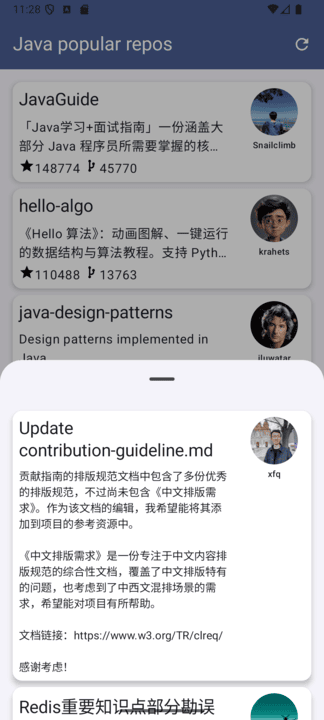
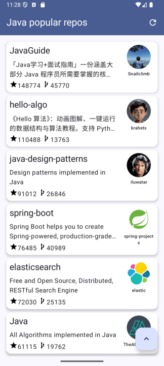

# GitHub Popular Java-repos

Este é um aplicativo Android para listar os repositórios Java mais populares do GitHub.

## Screenshots

## Abordagem

O aplicativo segue uma abordagem de desenvolvimento moderna e orientada a componentes para construir
um aplicativo Android robusto e escalável. A separação de responsabilidades e a capacidade de teste
são princípios fundamentais que foram considerados durante todo o processo de desenvolvimento.

## Arquitetura

O aplicativo usa a arquitetura de componentes recomendada pelo Google (MVVM):

* **UI Layer**: A camada de interface do usuário (UI) consiste em componentes de interface do
  usuário, como `Activitys`, `Fragments` ou `Composables`, que exibem dados e coletam ações do
  usuário. A camada de interface do usuário é construída usando o Jetpack Compose para uma interface
  de usuário declarativa e moderna.
* **Camada de domínio**: A camada de domínio contém a lógica de negócios. Ele é responsável por
  lidar com casos de uso específicos e interagir com a camada de dados.
* **Camada de dados**: A camada de dados contém o código responsável por lidar com dados. Ela obtém 
  dados remotos através da API pública do GitHub, e é responsável por expor
  esses dados para a camada de domínio.

A arquitetura usa os seguintes padrões:

* **MVVM (Model-View-ViewModel)**: O padrão MVVM é usado para separar a lógica da interface do
  usuário do código da interface do usuário. O ViewModel é responsável por preparar e manter os
  dados para a interface do usuário, e a interface do usuário observa as alterações nos dados
  fornecidos pelo ViewModel.
* **Injeção de dependência (Dagger2)**: A injeção de dependência é usada para reduzir o acoplamento entre os
  componentes do aplicativo. Isso torna o código mais testável e flexível.
* **Padrão de repositório**: O padrão de repositório é usado para abstrair a camada de dados. O
  padrão de repositório cria uma API limpa para a camada de domínio interagir.

## Bibliotecas

O aplicativo usa as seguintes bibliotecas:

* **Jetpack Compose**: A moderna biblioteca de interface do usuário do Android. Ele simplifica o
  desenvolvimento de interfaces de usuário, permitindo que você construa interfaces complexas de
  maneira declarativa.
* **Dagger2**: Uma biblioteca de injeção de dependência para Android que simplifica a injeção de
  dependências no aplicativo.
* **Retrofit**: Uma biblioteca de rede que facilita a conexão com APIs.
* **Moshi**: Uma biblioteca de serialização/desserialização de dados em JSON.
* **Glide**: Uma biblioteca de carregamento assíncrono de imagem.
* **RxJava**: Uma biblioteca para executar código assíncrono em Kotlin.
* **Paging**: Uma biblioteca para fazer a paginação dos dados, evitando que os dados sejam carregados numa única requisição.
* **ViewModel**: Uma classe do ciclo de vida do Android Jetpack que gerencia dados da interface do
  usuário e sobrevive a alterações de configuração.

## Instalação

Para executar o aplicativo, siga estas etapas:

1. Clone o repositório: `git clone https://github.com/ramirosneto/github-popular-repos.git`
2. Abra o projeto no Android Studio.
3. Execute o projeto em um dispositivo virtual ou físico.

Obs: Foi utilizada a seguinte versão do JDK para rodar o projeto
- jbr 21.0.5
